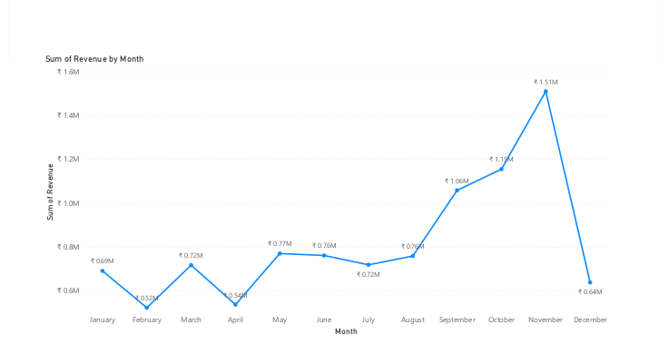
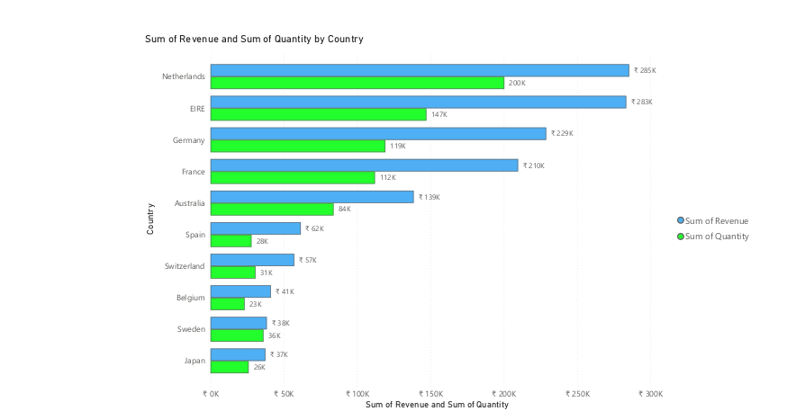
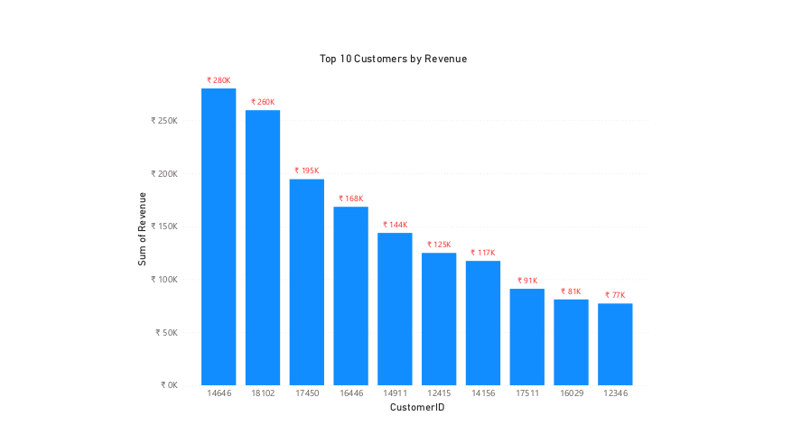
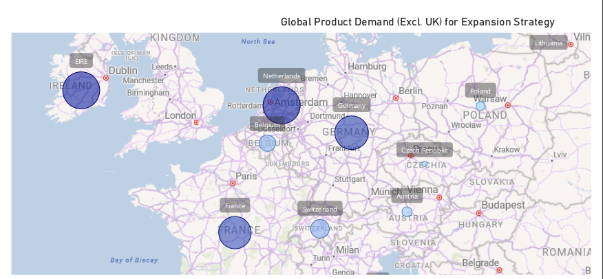

# Data Analysis and Visualisation - Project Details

## 1. Task Overview
In this phase, the goal was to clean the provided retail dataset and create impactful visuals to address specific requirements from the CEO and CMO. The focus was on identifying revenue trends, top markets, and customer demand to support the company's global expansion strategy.

## 2. Data Cleaning & Quality Control
Before building the dashboard, I performed rigorous data cleaning to ensure the insights were accurate and reliable.

**Key Cleaning Steps:**
* **Filtered Returns:** Implemented a logic to exclude all records where 'Quantity' was less than 1. This removed negative values caused by store returns.
* **Price Validation:** Created a check to remove any records with a 'Unit Price' below $0, eliminating data entry errors.
* **Timeframe Focus:** Filtered the data to focus specifically on the year 2011, as requested for next-year forecasting.
* **Regional Scope:** Excluded the "United Kingdom" from relevant visuals to provide a clear view of international expansion opportunities.

---

## 3. Visualisations & Executive Insights

### Question 1: Monthly Revenue Trend (2011)
**Objective:** Analyze the seasonal revenue patterns throughout 2011 for forecasting.

* **Analysis:** The visualization shows a significant upward trend towards the end of the year. Revenue peaked in **November at 1.51M**, indicating strong holiday season demand that requires increased operational capacity.

---

### Question 2: Top 10 Countries (Excluding UK)
**Objective:** Identify the top 10 international markets by revenue and quantity sold.

* **Analysis:** **Netherlands** emerges as the strongest international market with approximately **285K** in revenue, followed closely by EIRE. These countries represent the most stable regions for further investment.

---

### Question 3: Top 10 Customers by Revenue
**Objective:** Identify the highest-value customers to help the CMO with retention strategies.

* **Analysis:** The chart ranks the top 10 customers, with the leading customer (ID: 14646) contributing over **280K**. This data allows the marketing team to target these individuals with exclusive loyalty programs.

---

### Question 4: Global Demand Map
**Objective:** A geographical view of product demand across all regions (excluding the UK).

* **Analysis:** The map highlights high demand density across **Europe** and **Australia**. This single-view visualization confirms where the "expansion strategy" will have the highest impact.

---

## 4. Final Deliverables
* **Power BI File:** `Online_Retail_Analysis.pbix`
* **Executive Summary:** `Online_Retail_Analysis_insights.pdf`
* **Tools Used:** Power BI (Power Query & DAX), GitHub Markdown
